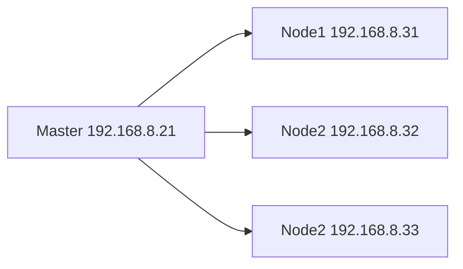
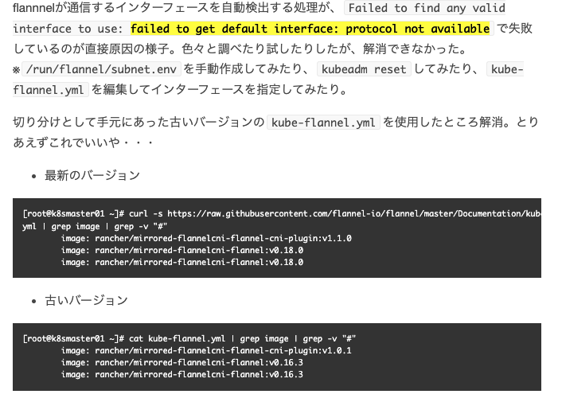

import CodeBlock from '@theme/CodeBlock';

This is a note of the Kubernetes tutorial.

## References

1. [Kubernetes](https://kubernetes.io/)
1. [Kubernetes tutorial (Chinese)](https://youtu.be/W3V-VgTjDjo)

## Physical Structure

### Single Master Node



### High-Availability Master Nodes

## Build K8S Cluster via Kubeadm

### OS image

[CentOS-7-x86_64-Minimal-2009.iso](https://ftp.riken.jp/Linux/centos/7.9.2009/isos/x86_64/)

### Min Spec 
- Lab environment (Master and Slaves)
  - CPU: 2 cores
  - Memory: 2GB
  - Disk: 100GB

### Install Tools

```bash title="run on all nodes"
# Install tools
yum install -y wget
yum install -y nano
yum install -y net-tools
```

### Close Firewall

```bash title="run on all nodes"
systemctl stop firewalld
systemctl disable firewalld
```

### Close swap

```bash title="run on all nodes"
swapoff -a
sed -ri 's/.*swap.*/#&/' /etc/fstab
```

### Set hostnames
```bash title="run on master"
hostnamectl set-hostname kube-master
```

```bash title="run on node1"
hostnamectl set-hostname kube-node1
```

```bash title="run on node2"
hostnamectl set-hostname kube-node2
```

```bash title="run on node3"
hostnamectl set-hostname kube-node3
```

### Set hosts

```bash title="run on master"
nano /etc/hosts
```

Fill in the following contents:

```text title="/etc/hosts"
192.168.8.21 kube-master
192.168.8.31 kube-node1
192.168.8.32 kube-node2
192.168.8.33 kube-node3
```

### Write Kube Traffic in iptables

```bash title="run on all nodes"
cat <<EOF > /etc/sysctl.d/k8s.conf
net.bridge.bridge-nf-call-ip6tables = 1
net.bridge.bridge-nf-call-iptables = 1
EOF

sysctl --system
```

### Install Docker

```bash title="run on all nodes"
yum install -y yum-utils
yum-config-manager --add-repo https://download.docker.com/linux/centos/docker-ce.repo
yum install -y docker-ce-18.06.1.ce-3.el7 docker-ce-cli-18.06.1.ce-3.el7 containerd.io docker-compose-plugin
systemctl enable docker && systemctl start docker
docker --version
```

### Install Kubelet

```bash title="run on all nodes"
cat <<EOF > /etc/yum.repos.d/kubernetes.repo
[kubernetes]
name=Kubernetes
baseurl=https://packages.cloud.google.com/yum/repos/kubernetes-el7-x86_64
enabled=1
gpgcheck=0
repo_gpgcheck=0
gpgkey=https://packages.cloud.google.com/yum/doc/yum-key.gpg https://packages.cloud.google.com/yum/doc/rpm-package-key.gpg
EOF

setenforce 0
sed -i 's/^SELINUX=enforcing$/SELINUX=permissive/' /etc/selinux/config

yum install -y kubelet-1.18.0 kubeadm-1.18.0 kubectl-1.18.0
systemctl enable kubelet

```

### Init Kube Master Node

```bash title="run on master"
kubeadm init --apiserver-advertise-address=192.168.8.21 --service-cidr=10.96.0.0/12 --pod-network-cidr=10.244.0.0/16

mkdir -p $HOME/.kube
cp -i /etc/kubernetes/admin.conf $HOME/.kube/config
chown $(id -u):$(id -g) $HOME/.kube/config
kubectl get nodes
```

The token is only valid for 24-hours. You can use the following command to generate a new token.

```bash
kubeadm token create --print-join-command
```

### Install flannel plugin

import KubeFlannelYMAL from '!!raw-loader!./assets/kube-flannel.yml';

<details>
  <summary>Save as `kube-flannel.yml`</summary>
  <CodeBlock language="yaml">{KubeFlannelYMAL}</CodeBlock>
</details>

```bash title="run on master"
$ kubectl apply -f kube-flannel.yml
$ kubectl get pods -n kube-system
$ kubectl get nodes
```

:::warning Installing flannel plugin may cause some problems.

Referencing https://none06.hatenadiary.org/entry/2022/05/28/025115

```bash title="Official Kube Flannel Yaml"
wget https://raw.githubusercontent.com/coreos/flannel/master/Documentation/kube-flannel.yml
nano kube-flannel.yml
```



:::

### Install Slave Nodes

This command should be copied from the contents that the master node generated.

```bash title="run on slave nodes"
 kubeadm join 192.168.8.21:6443 --token fxm6sy.jsw1uyarkx2fzsnw \
    --discovery-token-ca-cert-hash sha256:77c6f969d3e43942e4dea3b3c413ac9178fe89a2a6ac1a98254593eba574719e
```

### Startup Test Nginx Pod

```bash title="run on master"
kubectl create deployment nginx --image=nginx
kubectl get pods
kubectl expose deployment nginx --port=80 --type=NodePort
kubectl get pod, svc
kubectl get pods -A -o wide
```

Then you can access the Nginx service via the URL from any node.

http://<node_ip>:<exposed_port>/

## Build K8S Cluster via Binary

pending

## Ingress Controller

Ingress Controller is a Kubernetes add-on that provides a simple way to expose your services to the internet.

### Create Text Pods

```bash
kubectl create deployment web --image=nginx
kubectl get pods -o wide

# NAME                   READY   STATUS              RESTARTS   AGE   IP       NODE         NOMINATED NODE   READINESS GATES
# web-5dcb957ccc-px72n   0/1     ContainerCreating   0          7s    <none>   kube-node1   <none>           <none>

```

### Expose Port

```bash

kubectl expose deployment web --port=80 --target-port=80 --type=NodePort

kubectl get svc

# NAME         TYPE        CLUSTER-IP      EXTERNAL-IP   PORT(S)        AGE
# kubernetes   ClusterIP   10.96.0.1       <none>        443/TCP        3d14h
# web          NodePort    10.109.213.80   <none>        80:30622/TCP   70s

```

### Create Ingress Controller

import IngressControllerYAML from '!!raw-loader!./assets/ingress-controller.yml';

<details>
  <summary>Save as `ingress-controller.yml`</summary>
  <CodeBlock language="yaml">{IngressControllerYAML}</CodeBlock>
</details>

```bash title="run on master"
kubectl apply -f ingress-controller.yml 

# namespace/ingress-nginx created
# configmap/nginx-configuration created
# configmap/tcp-services created
# configmap/udp-services created
# serviceaccount/nginx-ingress-serviceaccount created
# clusterrole.rbac.authorization.k8s.io/nginx-ingress-clusterrole created
# role.rbac.authorization.k8s.io/nginx-ingress-role created
# rolebinding.rbac.authorization.k8s.io/nginx-ingress-role-nisa-binding created
# clusterrolebinding.rbac.authorization.k8s.io/nginx-ingress-clusterrole-nisa-binding created
# daemonset.apps/nginx-ingress-controller created
# service/ingress-nginx created

```

### Apply Ingress Controller

```bash
kubectl get pods -n ingress-nginx

# NAME                             READY   STATUS              RESTARTS   AGE
# nginx-ingress-controller-57wqf   0/1     ContainerCreating   0          111s
# nginx-ingress-controller-5spw2   0/1     Running             0          111s
# nginx-ingress-controller-kk552   0/1     ContainerCreating   0          111s
```

import IngressYAML from '!!raw-loader!./assets/ingress.yml';

<details>
  <summary>Save as `ingress.yml`</summary>
  <CodeBlock language="yaml">{IngressYAML}</CodeBlock>
</details>

```bash
kubectl apply -f ingress.yaml 
# ingress.networking.k8s.io/example-ingress created

kubectl get ing
# NAME              CLASS    HOSTS                   ADDRESS   PORTS   AGE
# example-ingress   <none>   example.ingredemo.com             80      5m52s
```

Then you can access the service with the `example.ingredemo.com`.


:::warning
`example.ingredemo.com` should be specified as the IP of any slave node.
:::

## HELM

### Introduce

- helm: a package manager for Kubernetes

- Chart: a collection of Kubernetes resources

- Release: version controll

### Usage

- Manage YAML
- Reuse YAML
- Version Control

### Install Helm

Ref: https://helm.sh/docs/intro/quickstart/

```bash
wget https://get.helm.sh/helm-v3.9.0-linux-amd64.tar.gz
tar zxvf helm-v3.9.0-linux-amd64.tar.gz
cp linux-amd64/helm /usr/bin/
helm version
```

### Config Helm Repository

```bash 
helm repo add stable https://charts.helm.sh/stable
helm repo add alicloud https://kubernetes.oss-cn-hangzhou.aliyuncs.com/charts
helm repo list
```

```bash title="update repo"
helm repo update
```

```bash title="remove repo"
helm repo remove alicloud
```

### App Deployment

```bash
helm search repo weave
# NAME                    CHART VERSION   APP VERSION     DESCRIPTION                                       
# stable/weave-cloud      0.3.9           1.4.0           DEPRECATED - Weave Cloud is a add-on to Kuberne...
# stable/weave-scope      1.1.12          1.12.0          DEPRECATED - A Helm chart for the Weave Scope c...
helm install ui stable/weave-scope
helm list
helm status ui
```

```bash title="Check Service and Expose Port"
kubectl get svc
# NAME             TYPE        CLUSTER-IP      EXTERNAL-IP   PORT(S)        AGE
# ui-weave-scope   ClusterIP   10.97.190.230   <none>        80/TCP         3m31s
kubectl edit svc ui-weave-scope
# Change 'type: ClusterIP' into 'type: NodePort'
kubectl get svc
NAME             TYPE        CLUSTER-IP      EXTERNAL-IP   PORT(S)        AGE
# ui-weave-scope   NodePort    10.97.190.230   <none>        80:32320/TCP   5m55s
```

### Create Chart and Reploy

```bash
helm create mychart
# Creating mychart
ls mychart/
# charts  Chart.yaml  templates  values.yaml
cd mychart/
```

#### charts

#### Chart.yaml

Current chart attributes.

#### templates

```bash
cd templates/
rm -rf *

kubectl create deployment web1 --image=nginx --dry-run=client -o yaml > deployment.yaml

kubectl create deployment web1 --image=nginx
kubectl expose deployment web1 --port=80 --target-port=80 --type=NodePort --dry-run=client -o yaml > service.yaml
kubectl delete deployment web1
```

#### values.yaml

Some global variables are used in the templates.


#### install chart

```bash
cd /root/
helm install web1 mychart/
# NAME: web1
# LAST DEPLOYED: Wed Jun  8 06:51:05 2022
# NAMESPACE: default
# STATUS: deployed
# REVISION: 1
# TEST SUITE: None

kubectl get pods -o wide
# NAME                                            READY   STATUS    RESTARTS   AGE     IP             NODE          NOMINATED NODE   READINESS GATES
# web1-7f87dfbd56-pz6wh                           1/1     Running   0          31s     10.244.4.72    kube-node3    <none>           <none>

kubectl get svc
# NAME             TYPE        CLUSTER-IP      EXTERNAL-IP   PORT(S)        AGE
# web1             NodePort    10.97.201.222   <none>        80:31459/TCP   76s
```

#### Upgrade Chart
```bash
helm upgrade web1 mychart/
# Release "web1" has been upgraded. Happy Helming!
# NAME: web1
# LAST DEPLOYED: Wed Jun  8 06:54:14 2022
# NAMESPACE: default
# STATUS: deployed
# REVISION: 2
# TEST SUITE: None
```

### Templates (Dynamic Parameters)

```bash
cd /root/mychart/
```

Change `values.yaml` as following:

import ValuesYAML from '!!raw-loader!./assets/values.yaml';

<details>
  <summary>Save as `values.yaml`</summary>
  <CodeBlock language="yaml">{ValuesYAML}</CodeBlock>
</details>

```bash
cd mychart/templates/

```

import DeploymentYAML from '!!raw-loader!./assets/deployment.yaml';

<details>
  <summary>Save as `deployment.yaml`</summary>
  <CodeBlock language="yaml">{DeploymentYAML}</CodeBlock>
</details>

```bash
cd /root
helm install --dry-run web2 mychart/
helm install web2 mychart/
# Release "web2" has been upgraded. Happy Helming!
# NAME: web2
# LAST DEPLOYED: Wed Jun  8 07:15:51 2022
# NAMESPACE: default
# STATUS: deployed
# REVISION: 1
# TEST SUITE: None

kubectl get pods
# NAME                                            READY   STATUS    RESTARTS   AGE
# web2-deploy-f89759699-9lkgw                     1/1     Running   0          59s

kubectl get svc
# NAME             TYPE        CLUSTER-IP      EXTERNAL-IP   PORT(S)        AGE
# web2-svc         NodePort    10.97.103.186   <none>        80:31374/TCP   44s
```


