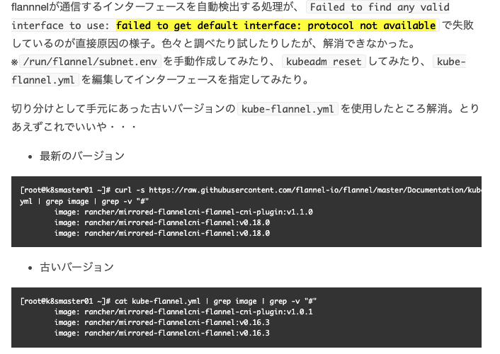

import CodeBlock from '@theme/CodeBlock';

This is a note of the Kubernetes tutorial.

## References

1. [Kubernetes](https://kubernetes.io/)
1. [Kubernetes tutorial (Chinese)](https://youtu.be/W3V-VgTjDjo)
1. [Prometheus 监控 k8s集群（集群部署）(Chinese)](https://www.jianshu.com/p/db15f4994de3)

## Physical Structure

### Single Master Node


### High-Availability Master Nodes

## Build K8S Cluster via Kubeadm

### OS image

[CentOS-7-x86_64-Minimal-2009.iso](https://ftp.riken.jp/Linux/centos/7.9.2009/isos/x86_64/)

### Min Spec 
- Lab environment (Master and Slaves)
  - CPU: 2 cores
  - Memory: 2GB
  - Disk: 100GB

### Install Tools

```bash title="run on all nodes"
# Install tools
yum install -y wget
yum install -y nano
yum install -y net-tools
```

### Close Firewall

```bash title="run on all nodes"
systemctl stop firewalld
systemctl disable firewalld
```

### Close swap

```bash title="run on all nodes"
swapoff -a
sed -ri 's/.*swap.*/#&/' /etc/fstab
```

### Set hostnames
```bash title="run on master"
hostnamectl set-hostname kube-master
```

```bash title="run on node1"
hostnamectl set-hostname kube-node1
```

```bash title="run on node2"
hostnamectl set-hostname kube-node2
```

```bash title="run on node3"
hostnamectl set-hostname kube-node3
```

### Set hosts

```bash title="run on master"
nano /etc/hosts
```

Fill in the following contents:

```text title="/etc/hosts"
192.168.8.21 kube-master
192.168.8.31 kube-node1
192.168.8.32 kube-node2
192.168.8.33 kube-node3
```

### Write Kube Traffic in iptables

```bash title="run on all nodes"
cat <<EOF > /etc/sysctl.d/k8s.conf
net.bridge.bridge-nf-call-ip6tables = 1
net.bridge.bridge-nf-call-iptables = 1
EOF

sysctl --system
```

### Install Docker

```bash title="run on all nodes"
yum install -y yum-utils
yum-config-manager --add-repo https://download.docker.com/linux/centos/docker-ce.repo
yum install -y docker-ce-18.06.1.ce-3.el7 docker-ce-cli-18.06.1.ce-3.el7 containerd.io docker-compose-plugin
systemctl enable docker && systemctl start docker
docker --version
```

### Install Kubelet

```bash title="run on all nodes"
cat <<EOF > /etc/yum.repos.d/kubernetes.repo
[kubernetes]
name=Kubernetes
baseurl=https://packages.cloud.google.com/yum/repos/kubernetes-el7-x86_64
enabled=1
gpgcheck=0
repo_gpgcheck=0
gpgkey=https://packages.cloud.google.com/yum/doc/yum-key.gpg https://packages.cloud.google.com/yum/doc/rpm-package-key.gpg
EOF

setenforce 0
sed -i 's/^SELINUX=enforcing$/SELINUX=permissive/' /etc/selinux/config

yum install -y kubelet-1.18.0 kubeadm-1.18.0 kubectl-1.18.0
systemctl enable kubelet

```

### Init Kube Master Node

```bash title="run on master"
kubeadm init --apiserver-advertise-address=192.168.8.21 --service-cidr=10.96.0.0/12 --pod-network-cidr=10.244.0.0/16

mkdir -p $HOME/.kube
cp -i /etc/kubernetes/admin.conf $HOME/.kube/config
chown $(id -u):$(id -g) $HOME/.kube/config
kubectl get nodes
```

The token is only valid for 24-hours. You can use the following command to generate a new one.

```bash
kubeadm token create --print-join-command
```

### Install flannel plugin

import KubeFlannelYMAL from '!!raw-loader!./assets/kube-flannel.yaml';

<details>
  <summary>Save as `kube-flannel.yml`</summary>
  <CodeBlock language="yaml">{KubeFlannelYMAL}</CodeBlock>
</details>

```bash title="run on master"
$ kubectl apply -f kube-flannel.yml
$ kubectl get pods -n kube-system
$ kubectl get nodes
```

:::warning Installing flannel plugin may cause some problems.

Referencing https://none06.hatenadiary.org/entry/2022/05/28/025115

```bash title="Official Kube Flannel Yaml"
wget https://raw.githubusercontent.com/coreos/flannel/master/Documentation/kube-flannel.yml
nano kube-flannel.yml
```



:::

### Install Slave Nodes

This command should be copied from the contents that the master node generated.

```bash title="run on slave nodes"
 kubeadm join 192.168.8.21:6443 --token fxm6sy.jsw1uyarkx2fzsnw \
    --discovery-token-ca-cert-hash sha256:77c6f969d3e43942e4dea3b3c413ac9178fe89a2a6ac1a98254593eba574719e
```

### Startup Test Nginx Pod

```bash title="run on master"
kubectl create deployment nginx --image=nginx
kubectl get pods
kubectl expose deployment nginx --port=80 --type=NodePort
kubectl get pod, svc
kubectl get pods -A -o wide
```

Then you can access the Nginx service via the URL from any node.

http://<node_ip>:<exposed_port>/

## Build K8S Cluster via Binary

pending

## Kubectl

### Delete Node

```bash title="run on master"
kubectl get nodes
# NAME          STATUS   ROLES    AGE   VERSION
# kube-master   Ready    master   10d   v1.18.0
# kube-node1    Ready    <none>   10d   v1.18.0
# kube-node2    Ready    <none>   10d   v1.18.0
# kube-node3    Ready    <none>   10d   v1.18.0

kubectl delete node kube-node3
# NAME          STATUS   ROLES    AGE   VERSION
# kube-master   Ready    master   10d   v1.18.0
# kube-node1    Ready    <none>   10d   v1.18.0
# kube-node2    Ready    <none>   10d   v1.18.0
```

```bash title="run on kube-node3"
kubeadm reset
# [reset] WARNING: Changes made to this host by 'kubeadm init' or 'kubeadm join' will be reverted.
# [reset] Are you sure you want to proceed? [y/N]: y
# [preflight] Running pre-flight checks
# W0613 05:24:48.614124   25596 removeetcdmember.go:79] [reset] No kubeadm config, using etcd pod spec to get data directory
# [reset] No etcd config found. Assuming external etcd
# [reset] Please, manually reset etcd to prevent further issues
# [reset] Stopping the kubelet service
# [reset] Unmounting mounted directories in "/var/lib/kubelet"
# [reset] Deleting contents of config directories: [/etc/kubernetes/manifests /etc/kubernetes/pki]
# [reset] Deleting files: [/etc/kubernetes/admin.conf /etc/kubernetes/kubelet.conf /etc/kubernetes/bootstrap-kubelet.conf /etc/kubernetes/controller-manager.conf /etc/kubernetes/scheduler.conf]
# [reset] Deleting contents of stateful directories: [/var/lib/kubelet /var/lib/dockershim /var/run/kubernetes /var/lib/cni]

# The reset process does not clean CNI configuration. To do so, you must remove /etc/cni/net.d

# The reset process does not reset or clean up iptables rules or IPVS tables.
# If you wish to reset iptables, you must do so manually by using the "iptables" command.

# If your cluster was setup to utilize IPVS, run ipvsadm --clear (or similar)
# to reset your system's IPVS tables.

# The reset process does not clean your kubeconfig files and you must remove them manually.
# Please, check the contents of the $HOME/.kube/config file.
```

## Ingress Controller

Ingress Controller is a Kubernetes add-on that provides a simple way to expose your services to the internet.

### Create Text Pods

```bash
kubectl create deployment web --image=nginx
kubectl get pods -o wide

# NAME                   READY   STATUS              RESTARTS   AGE   IP       NODE         NOMINATED NODE   READINESS GATES
# web-5dcb957ccc-px72n   0/1     ContainerCreating   0          7s    <none>   kube-node1   <none>           <none>

```

### Expose Port

```bash

kubectl expose deployment web --port=80 --target-port=80 --type=NodePort

kubectl get svc

# NAME         TYPE        CLUSTER-IP      EXTERNAL-IP   PORT(S)        AGE
# kubernetes   ClusterIP   10.96.0.1       <none>        443/TCP        3d14h
# web          NodePort    10.109.213.80   <none>        80:30622/TCP   70s

```

### Create Ingress Controller

import IngressControllerYAML from '!!raw-loader!./assets/ingress-controller.yml';

<details>
  <summary>Save as `ingress-controller.yml`</summary>
  <CodeBlock language="yaml">{IngressControllerYAML}</CodeBlock>
</details>

```bash title="run on master"
kubectl apply -f ingress-controller.yml 

# namespace/ingress-nginx created
# configmap/nginx-configuration created
# configmap/tcp-services created
# configmap/udp-services created
# serviceaccount/nginx-ingress-serviceaccount created
# clusterrole.rbac.authorization.k8s.io/nginx-ingress-clusterrole created
# role.rbac.authorization.k8s.io/nginx-ingress-role created
# rolebinding.rbac.authorization.k8s.io/nginx-ingress-role-nisa-binding created
# clusterrolebinding.rbac.authorization.k8s.io/nginx-ingress-clusterrole-nisa-binding created
# daemonset.apps/nginx-ingress-controller created
# service/ingress-nginx created

```

### Apply Ingress Controller

```bash
kubectl get pods -n ingress-nginx

# NAME                             READY   STATUS              RESTARTS   AGE
# nginx-ingress-controller-57wqf   0/1     ContainerCreating   0          111s
# nginx-ingress-controller-5spw2   0/1     Running             0          111s
# nginx-ingress-controller-kk552   0/1     ContainerCreating   0          111s
```

import IngressYAML from '!!raw-loader!./assets/ingress.yml';

<details>
  <summary>Save as `ingress.yml`</summary>
  <CodeBlock language="yaml">{IngressYAML}</CodeBlock>
</details>

```bash
kubectl apply -f ingress.yaml 
# ingress.networking.k8s.io/example-ingress created

kubectl get ing
# NAME              CLASS    HOSTS                   ADDRESS   PORTS   AGE
# example-ingress   <none>   example.ingredemo.com             80      5m52s
```

Then you can access the service with the `example.ingredemo.com`.


:::warning
`example.ingredemo.com` should be specified as the IP of any slave node.
:::

## HELM

### Introduce

- helm: a package manager for Kubernetes

- Chart: a collection of Kubernetes resources

- Release: version controll

### Usage

- Manage YAML
- Reuse YAML
- Version Control

### Install Helm

Ref: https://helm.sh/docs/intro/quickstart/

```bash
wget https://get.helm.sh/helm-v3.9.0-linux-amd64.tar.gz
tar zxvf helm-v3.9.0-linux-amd64.tar.gz
cp linux-amd64/helm /usr/bin/
helm version
```

### Config Helm Repository

```bash 
helm repo add stable https://charts.helm.sh/stable
helm repo add alicloud https://kubernetes.oss-cn-hangzhou.aliyuncs.com/charts
helm repo list
```

```bash title="update repo"
helm repo update
```

```bash title="remove repo"
helm repo remove alicloud
```

### App Deployment

```bash
helm search repo weave
# NAME                    CHART VERSION   APP VERSION     DESCRIPTION                                       
# stable/weave-cloud      0.3.9           1.4.0           DEPRECATED - Weave Cloud is a add-on to Kuberne...
# stable/weave-scope      1.1.12          1.12.0          DEPRECATED - A Helm chart for the Weave Scope c...
helm install ui stable/weave-scope
helm list
helm status ui
```

```bash title="Check Service and Expose Port"
kubectl get svc
# NAME             TYPE        CLUSTER-IP      EXTERNAL-IP   PORT(S)        AGE
# ui-weave-scope   ClusterIP   10.97.190.230   <none>        80/TCP         3m31s
kubectl edit svc ui-weave-scope
# Change 'type: ClusterIP' into 'type: NodePort'
kubectl get svc
NAME             TYPE        CLUSTER-IP      EXTERNAL-IP   PORT(S)        AGE
# ui-weave-scope   NodePort    10.97.190.230   <none>        80:32320/TCP   5m55s
```

### Create Chart and Reploy

```bash
helm create mychart
# Creating mychart
ls mychart/
# charts  Chart.yaml  templates  values.yaml
cd mychart/
```

#### charts

#### Chart.yaml

Current chart attributes.

#### templates

```bash
cd templates/
rm -rf *

kubectl create deployment web1 --image=nginx --dry-run=client -o yaml > deployment.yaml

kubectl create deployment web1 --image=nginx
kubectl expose deployment web1 --port=80 --target-port=80 --type=NodePort --dry-run=client -o yaml > service.yaml
kubectl delete deployment web1
```

#### values.yaml

Some global variables are used in the templates.


#### install chart

```bash
cd /root/
helm install web1 mychart/
# NAME: web1
# LAST DEPLOYED: Wed Jun  8 06:51:05 2022
# NAMESPACE: default
# STATUS: deployed
# REVISION: 1
# TEST SUITE: None

kubectl get pods -o wide
# NAME                                            READY   STATUS    RESTARTS   AGE     IP             NODE          NOMINATED NODE   READINESS GATES
# web1-7f87dfbd56-pz6wh                           1/1     Running   0          31s     10.244.4.72    kube-node3    <none>           <none>

kubectl get svc
# NAME             TYPE        CLUSTER-IP      EXTERNAL-IP   PORT(S)        AGE
# web1             NodePort    10.97.201.222   <none>        80:31459/TCP   76s
```

#### Upgrade Chart
```bash
helm upgrade web1 mychart/
# Release "web1" has been upgraded. Happy Helming!
# NAME: web1
# LAST DEPLOYED: Wed Jun  8 06:54:14 2022
# NAMESPACE: default
# STATUS: deployed
# REVISION: 2
# TEST SUITE: None
```

### Templates (Dynamic Parameters)

```bash
cd /root/mychart/
```

Change `values.yaml` as following:

import ValuesYAML from '!!raw-loader!./assets/values.yaml';

<details>
  <summary>Save as `values.yaml`</summary>
  <CodeBlock language="yaml">{ValuesYAML}</CodeBlock>
</details>

```bash
cd mychart/templates/

```

import DeploymentYAML from '!!raw-loader!./assets/deployment.yaml';

<details>
  <summary>Save as `deployment.yaml`</summary>
  <CodeBlock language="yaml">{DeploymentYAML}</CodeBlock>
</details>

```bash
cd /root
helm install --dry-run web2 mychart/
helm install web2 mychart/
# Release "web2" has been upgraded. Happy Helming!
# NAME: web2
# LAST DEPLOYED: Wed Jun  8 07:15:51 2022
# NAMESPACE: default
# STATUS: deployed
# REVISION: 1
# TEST SUITE: None

kubectl get pods
# NAME                                            READY   STATUS    RESTARTS   AGE
# web2-deploy-f89759699-9lkgw                     1/1     Running   0          59s

kubectl get svc
# NAME             TYPE        CLUSTER-IP      EXTERNAL-IP   PORT(S)        AGE
# web2-svc         NodePort    10.97.103.186   <none>        80:31374/TCP   44s
```


## NFS PV PVC

### NFS


```bash title="on NFS Server"
yum install -y nfs-utils
mkdir -p /data/nfs
echo "/data/nfs *(rw,sync,no_root_squash,no_subtree_check)" >> /etc/exports
systemctl start rpcbind
systemctl start nfs
systemctl enable rpcbind
systemctl enable nfs
ps -ef | grep nfs

echo "<h1>hello nfs</h1>" > /data/nfs/index.html
```

```bash title="on node1 and node2 and node3"
yum install -y nfs-utils
```

import NFSNginxYAML from '!!raw-loader!./assets/nfs-nginx.yaml';

<details>
  <summary>Save as `nfs-nginx.yaml` on master</summary>
  <CodeBlock language="yaml">{NFSNginxYAML}</CodeBlock>
</details>

```bash title="on master"
kubectl apply -f nfs-nginx.yaml
kubectl get pods
# NAME                                            READY   STATUS              RESTARTS   AGE
# nfs-dep1-6b58cbd59-f7g4s                        0/1     ContainerCreating   0          53s
kubectl exec -it nfs-dep1-6b58cbd59-f7g4s -- /bin/bash
ls /usr/share/nginx/html
# index.html
kubectl expose deployment nginx-dep1 --port=80 --target-port=80 --type=NodePort
```

## PV and PVC

- PV: Permanent Volume, A provider volume that abstracts storage resources.
- PVC: Persistent Volume Claim, A consumer requests a volume.

- Procedure:
  - Develop app
  - Defind PVC
  - Defind PV

### Defind PVC

import PVCYAML from '!!raw-loader!./assets/pvc.yaml';

<details>
  <summary>Save as `pvc.yaml`</summary>
  <CodeBlock language="yaml">{PVCYAML}</CodeBlock>
</details>

```bash title="on master"
kubectl apply -f pvc.yaml
```

### Define PV

import PVYAML from '!!raw-loader!./assets/pv.yaml';

<details>
  <summary>Save as `pv.yaml`</summary>
  <CodeBlock language="yaml">{PVYAML}</CodeBlock>
</details>

```bash title="on master"
kubectl apply -f pv.yaml
# persistentvolume/my-pv created

kubectl get pv,pvc
# NAME                     CAPACITY   ACCESS MODES   RECLAIM POLICY   STATUS   CLAIM            STORAGECLASS   REASON   AGE
# persistentvolume/my-pv   5Gi        RWX            Retain           Bound    default/my-pvc                           52s
# NAME                           STATUS   VOLUME   CAPACITY   ACCESS MODES   STORAGECLASS   AGE
# persistentvolumeclaim/my-pvc   Bound    my-pv    5Gi        RWX                           4m7s

kubectl get pods
# NAME                          READY   STATUS        RESTARTS   AGE
# nginx-dep1-58b7bf955f-btpv4   1/1     Running       0          4m50s
# nginx-dep1-58b7bf955f-t97hw   1/1     Running       0          4m50s
# nginx-dep1-58b7bf955f-vzj8x   1/1     Running       0          4m50s
```

### Test

```bash title="on master"
kubectl exec -it nginx-dep1-58b7bf955f-btpv4 -- /bin/bash
cat /usr/share/nginx/html/index.html 
# <h1>hello nfs</h1>
```

## Monitoring

### Monitoring Index

- Cluster Monitoring
  - Node Resouce Utillzation
  - Node Number
  - Node Pods
- Pods Monitoring
  - Containers 
  - Applications

### Prometheus

- An open-source monitoring system.
- Monitoring, Alerting, and DataStorage.
- Using HTTP to extract K8S components status periodically.


import RBACSetupYAML from '!!raw-loader!./assets/rbac-setup.yaml';

<details>
  <summary>Save as `rbac-setup.yaml`</summary>
  <CodeBlock language="yaml">{RBACSetupYAML}</CodeBlock>
</details>

import ConfigMapYAML from '!!raw-loader!./assets/configmap.yaml';

<details>
  <summary>Save as `configmap.yaml`</summary>
  <CodeBlock language="yaml">{ConfigMapYAML}</CodeBlock>
</details>

import PrometheusDeployYAML from '!!raw-loader!./assets/prometheus.deploy.yaml';

<details>
  <summary>Save as `prometheus.deploy.yaml`</summary>
  <CodeBlock language="yaml">{PrometheusDeployYAML}</CodeBlock>
</details>


import PrometheusSVCYAML from '!!raw-loader!./assets/prometheus.svc.yaml';

<details>
  <summary>Save as `prometheus.svc.yaml`</summary>
  <CodeBlock language="yaml">{PrometheusSVCYAML}</CodeBlock>
</details>

import NodeExporterYAML from '!!raw-loader!./assets/node-exporter.yaml';

<details>
  <summary>Save as `node-exporter.yaml`</summary>
  <CodeBlock language="yaml">{NodeExporterYAML}</CodeBlock>
</details>

```bash title="on master"

kubectl create -f node-exporter.yaml
# daemonset.apps/node-exporter created
# service/node-exporter created

kubectl create -f rbac-setup.yaml
# clusterrolebinding.rbac.authorization.k8s.io/prometheus created

kubectl create -f configmap.yaml
# configmap/prometheus-config created

kubectl create -f prometheus.deploy.yaml 
# deployment.apps/prometheus created

kubectl create -f prometheus.svc.yaml 
# service/prometheus created

kubectl get pods -n kube-system
# NAME                                  READY   STATUS              RESTARTS   AGE
# node-exporter-4qlmd                   1/1     Running   0          5m36s
# node-exporter-bhfhg                   1/1     Running   0          5m35s
# prometheus-7486bf7f4b-mdkcm           1/1     Running   0          95s
```

### Grafana

import GrafanaDeployYAML from '!!raw-loader!./assets/grafana-deploy.yaml';

<details>
  <summary>Save as `grafana-deploy.yaml`</summary>
  <CodeBlock language="yaml">{GrafanaDeployYAML}</CodeBlock>
</details>

import GrafanaSVC from '!!raw-loader!./assets/grafana-svc.yaml';

<details>
  <summary>Save as `grafana-svc.yaml`</summary>
  <CodeBlock language="yaml">{GrafanaSVC}</CodeBlock>
</details>

import GrafanaIng from '!!raw-loader!./assets/grafana-ing.yaml';

<details>
  <summary>Save as `grafana-ing.yaml`</summary>
  <CodeBlock language="yaml">{GrafanaIng}</CodeBlock>
</details>

```bash title="on master"
kubectl create -f grafana-deploy.yaml
# deployment.apps/grafana-core created

kubectl create -f grafana-svc.yaml
# service/grafana created

kubectl create -f grafana-ing.yaml
# ingress.extensions/grafana created

kubectl get pods -n kube-system
# NAME                                  READY   STATUS    RESTARTS   AGE
# grafana-core-768b6bf79c-xdgj4         0/1     Running   0          117s
# prometheus-7486bf7f4b-mdkcm           1/1     Running   0          9m
```

### Config Grafana

#### Access Grafana Web UI

```bash title="on master"
kubectl get svc -n kube-system
# NAME            TYPE        CLUSTER-IP       EXTERNAL-IP   PORT(S)                  AGE
# grafana         NodePort    10.96.26.29      <none>        3000:30178/TCP           2m48s
# prometheus      NodePort    10.108.160.161   <none>        9090:30003/TCP           10m
```

Therefore, access Grafana http://192.168.8.31:30178/login on your browser.

Default user is `admin` and password is `admin`.

#### Add data source


The `Url` should be the `CLUSTER-IP` which you can get from `kubectl get svc -n kube-system`.

#### Add Template 


Notice that, the 315 is a template of K8S Monitoring.


#### See Your Monitoring Dashboard


## High Availability

The current cluster architecture is dangerous if the single master node is down.
It should be constituted as a HA cluster as follows.

```mermaid
graph LR
  master1[Master1 192.168.8.21]
  master2[Master2 192.168.8.22]
  lb[Load Balancer (VIP 192.168.8.20)]
  node1[Node1 192.168.8.31]
  node2[Node2 192.168.8.32]
  master1 --> lb
  master2 --> lb
  lb --> node1
  lb --> node2
```

### Reset All Nodes

```bash title="on master"
kubectl delete node kube-node1
# node "kube-node1" deleted
kubectl delete node kube-node2
# node "kube-node2" deleted
```

```bash title="on slave nodes"
kubeadm reset
```

```bash title="on master"
kubeadm reset
```

### Reconfig Master Node1 (192.168.8.21)

```text title="on master, replace /etc/hosts"
127.0.0.1   localhost localhost.localdomain localhost4 localhost4.localdomain4
::1         localhost localhost.localdomain localhost6 localhost6.localdomain6
192.168.8.20 kube-master.k8s.io kube-master
192.168.8.21 kube-master1.k8s.io kube-master1
192.168.8.22 kube-master2.k8s.io kube-master2
192.168.8.31 kube-node1.k8s.io kube-node1
192.168.8.32 kube-node2.k8s.io kube-node2
192.168.8.33 kube-node3.k8s.io kube-node3
```

```bash title="on master1"
hostnamectl set-hostname kube-master1
```

### Install System on Master Node2 (192.168.8.21)

Do init installation on master node 2 following `Build K8S Cluster via Kubeadm` section.

Notice that the `hosts` file on master node 2 should be the same as master node 1.

```text title="on master2 etc/hosts"
127.0.0.1   localhost localhost.localdomain localhost4 localhost4.localdomain4
::1         localhost localhost.localdomain localhost6 localhost6.localdomain6
192.168.8.20 kube-master.k8s.io kube-master
192.168.8.21 kube-master1.k8s.io kube-master1
192.168.8.22 kube-master2.k8s.io kube-master2
192.168.8.31 kube-node1.k8s.io kube-node1
192.168.8.32 kube-node2.k8s.io kube-node2
192.168.8.33 kube-node3.k8s.io kube-node3
```

### Config Keepalived on Masters

```bash title="on master1 and master2"
yum install -y keepalived conntrack-tools libseccomp libtool-ltd1
```

import Keepalived1 from '!!raw-loader!./assets/keepalived.conf';

<details>
  <summary>Config `/etc/keepalived/keepalived.conf` referencing follows</summary>
  <CodeBlock language="conf">{Keepalived1}</CodeBlock>
</details>

Notice that the `interface` and `virtual_ipaddress` should be modified according to your environment.

```bash title="on master1 and master2"
systemctl start keepalived.service
systemctl enable keepalived.service
systemctl status keepalived.service
# ...
# Jun 13 06:21:04 kube-master1 Keepalived_vrrp[31554]: VRRP_Instance(VI_1) Sending/queueing gratuitous ARPs on eth0 for 192.168.8.20
# ...
```

```bash title="on master1 and master2"
ip a s eth0
# 2: eth0: <BROADCAST,MULTICAST,UP,LOWER_UP> mtu 1500 qdisc pfifo_fast state UP group default qlen 1000
#     link/ether 02:11:32:2b:87:ba brd ff:ff:ff:ff:ff:ff
#     inet 192.168.8.21/24 brd 192.168.8.255 scope global noprefixroute eth0
#        valid_lft forever preferred_lft forever
#     inet 192.168.8.20/32 scope global eth0
#        valid_lft forever preferred_lft forever
```

If master 1 is down, the VIP will drift to master 2.

### Config haproxy on Masters

```bash title="on master1 and master2"
yum install -y haproxy
```

import Haproxy from '!!raw-loader!./assets/haproxy.cfg';

<details>
  <summary>Config `/etc/haproxy/haproxy.cfg` referencing follows</summary>
  <CodeBlock language="conf">{Haproxy}</CodeBlock>
</details>

```bash title="on master1 and master2"
systemctl start haproxy.service
systemctl enable haproxy.service
systemctl status haproxy.service
# ...
# Active: active (running) since
# ...

netstat -lntup|grep haproxy
# tcp        0      0 0.0.0.0:1080            0.0.0.0:*               LISTEN      19504/haproxy       
# tcp        0      0 0.0.0.0:16443           0.0.0.0:*               LISTEN      19504/haproxy       
# udp        0      0 0.0.0.0:55052           0.0.0.0:*                           19501/haproxy
```

### Config K8S on Master 1

:::warning
The following commands must be performed on a master node that has VIP.
Here resume the master node 1 is the VIP master.
:::

```bash title="on master1"
mkdir /usr/local/kubernetes/manifests -p 
```

import KubeadmConfig from '!!raw-loader!./assets/kubeadm-config.yaml';

<details>
  <summary>Config `/usr/local/kubernetes/manifests/kubeadm-config.yaml` referencing follows</summary>
  <CodeBlock language="yaml">{KubeadmConfig}</CodeBlock>
</details>

```bash title="on master1"
kubeadm init --config /usr/local/kubernetes/manifests/kubeadm-config.yaml
# ...
# mkdir -p $HOME/.kube
# sudo cp -i /etc/kubernetes/admin.conf $HOME/.kube/config
# sudo chown $(id -u):$(id -g) $HOME/.kube/config
# ...
# kubeadm join kube-master1.k8s.io:16443 --token cfkgse.2yzjhgn4ykn4ny8y \
#   --discovery-token-ca-cert-hash sha256:4a56b1dbc3456a1d11cf8ace3c22a8569702966ab035f666e2f96ba7fb5c9d39 \
#   --control-plane
# ...
# kubeadm join kube-master1.k8s.io:16443 --token cfkgse.2yzjhgn4ykn4ny8y \
#     --discovery-token-ca-cert-hash sha256:4a56b1dbc3456a1d11cf8ace3c22a8569702966ab035f666e2f96ba7fb5c9d39

mkdir -p $HOME/.kube
cp -i /etc/kubernetes/admin.conf $HOME/.kube/config
chown $(id -u):$(id -g) $HOME/.kube/config
kubectl get nodes
```

```bash title="on master1"
kubectl get cs
# NAME                 STATUS    MESSAGE             ERROR
# scheduler            Healthy   ok                  
# controller-manager   Healthy   ok                  
# etcd-0               Healthy   {"health":"true"}

kubectl get pods -n kube-system
# NAME                                   READY   STATUS    RESTARTS   AGE
# coredns-66bff467f8-259f6               1/1     Running   0          2m2s
# coredns-66bff467f8-pj8ct               1/1     Running   0          2m3s
# etcd-kube-master1                      1/1     Running   0          2m47s
# kube-apiserver-kube-master1            1/1     Running   0          2m47s
# kube-controller-manager-kube-master1   1/1     Running   1          3m8s
# kube-proxy-lwxkb                       1/1     Running   0          2m3s
# kube-scheduler-kube-master1            1/1     Running   0          2m46s
```

Then you can config the flannel network referencing **Install flannel plugin** section.

### Config K8S on Master 2

#### Copy Certification Files from Master 1 to 2

```bash title="on master1"
ssh root@kube-master2 mkdir -p /etc/kubernetes/pki/etcd
scp /etc/kubernetes/admin.conf root@kube-master2:/etc/kubernetes
scp /etc/kubernetes/pki/{ca.*,sa.*,front-proxy-ca.*} root@kube-master2:/etc/kubernetes/pki
scp /etc/kubernetes/pki/etcd/ca.* root@kube-master2:/etc/kubernetes/pki/etcd
```

#### Add Master 2 into Cluster

Run the '--control-plane' one which was output by the master 1.

```bash title="on master2"
kubeadm join kube-master1.k8s.io:16443 --token cfkgse.2yzjhgn4ykn4ny8y \
  --discovery-token-ca-cert-hash sha256:4a56b1dbc3456a1d11cf8ace3c22a8569702966ab035f666e2f96ba7fb5c9d39 \
  --control-plane


mkdir -p $HOME/.kube
sudo cp -i /etc/kubernetes/admin.conf $HOME/.kube/config
sudo chown $(id -u):$(id -g) $HOME/.kube/config
```

```bash title="on master2"
kubectl get nodes
# NAME           STATUS   ROLES    AGE    VERSION
# kube-master1   Ready    master   23m    v1.18.0
# kube-master2   Ready    master   110s   v1.18.0
```

### Config Slave Nodes

```text title="on master2 etc/hosts"
127.0.0.1   localhost localhost.localdomain localhost4 localhost4.localdomain4
::1         localhost localhost.localdomain localhost6 localhost6.localdomain6
192.168.8.20 kube-master.k8s.io kube-master
192.168.8.21 kube-master1.k8s.io kube-master1
192.168.8.22 kube-master2.k8s.io kube-master2
192.168.8.31 kube-node1.k8s.io kube-node1
192.168.8.32 kube-node2.k8s.io kube-node2
192.168.8.33 kube-node3.k8s.io kube-node3
```

Run the command WITH OUT '--control-plane' which was output by the master 1.

```bash title="on slave nodes"
kubeadm join kube-master1.k8s.io:16443 --token cfkgse.2yzjhgn4ykn4ny8y \
    --discovery-token-ca-cert-hash sha256:4a56b1dbc3456a1d11cf8ace3c22a8569702966ab035f666e2f96ba7fb5c9d39
```

```bash title="on master"
kubectl get nodes
# NAME           STATUS   ROLES    AGE   VERSION
# kube-master1   Ready    master   62m   v1.18.0
# kube-master2   Ready    master   41m   v1.18.0
# kube-node1     Ready    <none>   35m   v1.18.0
# kube-node2     Ready    <none>   39s   v1.18.0

kubectl get pods -n kube-system -o wide
# NAME                                   READY   STATUS    RESTARTS   AGE     IP             NODE           NOMINATED NODE   READINESS GATES
# coredns-66bff467f8-259f6               1/1     Running   0          62m     10.244.0.3     kube-master1   <none>           <none>
# coredns-66bff467f8-pj8ct               1/1     Running   0          62m     10.244.0.2     kube-master1   <none>           <none>
# etcd-kube-master1                      1/1     Running   0          63m     192.168.8.21   kube-master1   <none>           <none>
# etcd-kube-master2                      1/1     Running   0          42m     192.168.8.22   kube-master2   <none>           <none>
# kube-apiserver-kube-master1            1/1     Running   0          63m     192.168.8.21   kube-master1   <none>           <none>
# kube-apiserver-kube-master2            1/1     Running   0          42m     192.168.8.22   kube-master2   <none>           <none>
# kube-controller-manager-kube-master1   1/1     Running   2          63m     192.168.8.21   kube-master1   <none>           <none>
# kube-controller-manager-kube-master2   1/1     Running   1          42m     192.168.8.22   kube-master2   <none>           <none>
# kube-flannel-ds-dp56p                  1/1     Running   0          43m     192.168.8.22   kube-master2   <none>           <none>
# kube-flannel-ds-j2l9t                  1/1     Running   0          53m     192.168.8.21   kube-master1   <none>           <none>
# kube-flannel-ds-k4mvt                  1/1     Running   1          37m     192.168.8.31   kube-node1     <none>           <none>
# kube-flannel-ds-z7nz8                  1/1     Running   1          2m33s   192.168.8.32   kube-node2     <none>           <none>
# kube-proxy-5nsfj                       1/1     Running   0          2m33s   192.168.8.32   kube-node2     <none>           <none>
# kube-proxy-8v5wz                       1/1     Running   0          37m     192.168.8.31   kube-node1     <none>           <none>
# kube-proxy-lwxkb                       1/1     Running   0          62m     192.168.8.21   kube-master1   <none>           <none>
# kube-proxy-wp984                       1/1     Running   0          43m     192.168.8.22   kube-master2   <none>           <none>
# kube-scheduler-kube-master1            1/1     Running   2          63m     192.168.8.21   kube-master1   <none>           <none>
# kube-scheduler-kube-master2            1/1     Running   2          42m     192.168.8.22   kube-master2   <none>           <none>

```

The HA cluster is now ready to use.

### Test the HA Cluster

```bash title="on master"
kubectl create deployment nginx --image=nginx
# deployment.apps/nginx created

kubectl expose deployment nginx --port=80 --type=NodePort
# service/nginx exposed

kubectl get pod,svc
# NAME                        READY   STATUS    RESTARTS   AGE
# pod/nginx-f89759699-sm8zs   1/1     Running   0          43s

# NAME                 TYPE        CLUSTER-IP     EXTERNAL-IP   PORT(S)        AGE
# service/kubernetes   ClusterIP   10.1.0.1       <none>        443/TCP        67m
# service/nginx        NodePort    10.1.167.111   <none>        80:30754/TCP   68s
```

Then you can access the Nginx service with VIP:  http://192.168.8.20:30754

```bash title="on master1"
shutdown -h now
# Connection to 192.168.8.21 closed by remote host.
# Connection to 192.168.8.21 closed.
```

```bash title="on master2"
ip a s eth0
# 2: eth0: <BROADCAST,MULTICAST,UP,LOWER_UP> mtu 1500 qdisc pfifo_fast state UP group default qlen 1000
#     link/ether 02:11:32:25:17:76 brd ff:ff:ff:ff:ff:ff
#     inet 192.168.8.22/24 brd 192.168.8.255 scope global noprefixroute eth0
#        valid_lft forever preferred_lft forever
#     inet 192.168.8.20/32 scope global eth0
#        valid_lft forever preferred_lft forever
```

Then you can still access the Nginx service with VIP:  http://192.168.8.20:30754